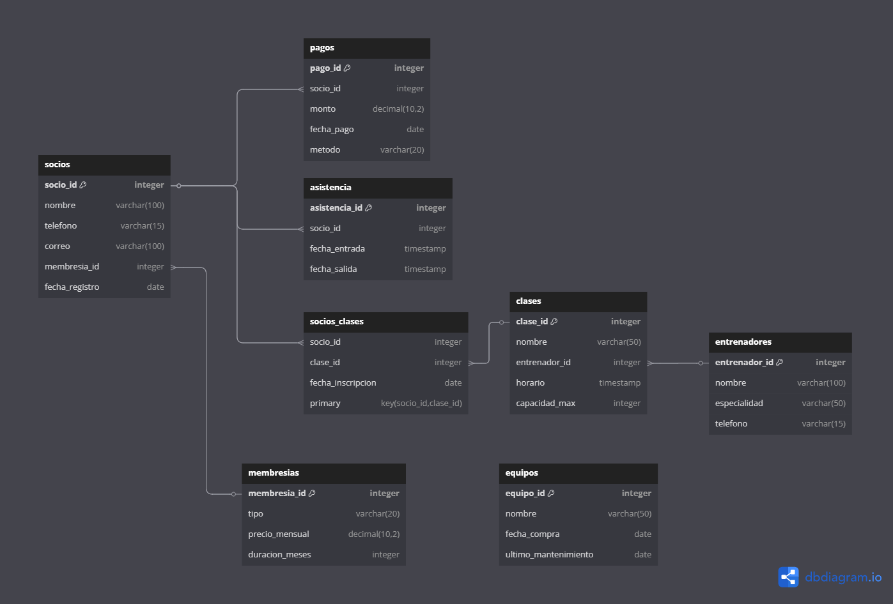

# 🏋️ Diseño de Base de Datos - Sistema de Gestión de Gimnasio
## Documentación Técnica para Sistema de Administración Integral de Gimnasios

---

## 📋 Índice Técnico
- [Análisis y Metodología de Diseño](#análisis-y-metodología-de-diseño)
- [Arquitectura de Datos](#arquitectura-de-datos)
- [Modelo Conceptual y Lógico](#modelo-conceptual-y-lógico)
- [Diagrama Entidad-Relación](#diagrama-entidad-relación)
- [Normalización y Análisis de Formas Normales](#normalización-y-análisis-de-formas-normales)
- [Diseño Físico y Optimización](#diseño-físico-y-optimización)
- [Estructura de Tablas y Dominios](#estructura-de-tablas-y-dominios)
- [Integridad Referencial y Restricciones](#integridad-referencial-y-restricciones)
- [Estrategias de Indexación](#estrategias-de-indexación)
- [Performance Tuning y Optimización](#performance-tuning-y-optimización)
- [Procedimientos Almacenados y Funciones](#procedimientos-almacenados-y-funciones)
- [Estrategias de Escalabilidad](#estrategias-de-escalabilidad)
- [Implementación y Configuración](#implementación-y-configuración)
- [Testing y Validación](#testing-y-validación)
- [Mantenimiento y Monitoreo](#mantenimiento-y-monitoreo)

---

## 🎯 Análisis y Metodología de Diseño

### Enfoque Metodológico Aplicado

Este proyecto demuestra la aplicación de **metodologías profesionales de diseño de bases de datos** específicamente adaptadas para **sistemas de gestión de gimnasios**, siguiendo un enfoque estructurado que abarca desde el análisis de requisitos operacionales hasta la implementación física optimizada para transacciones de membresías y control de acceso.

#### **Metodología Utilizada: Modelo Relacional para Gestión de Gimnasios**
- **Fase 1**: Análisis de Requisitos Operacionales y Modelado Conceptual
- **Fase 2**: Diseño Lógico con Normalización para Gestión de Socios
- **Fase 3**: Diseño Físico con Optimización para Check-ins y Pagos
- **Fase 4**: Implementación con Estrategias de Escalabilidad Multi-sucursal

### Análisis de Requisitos de Datos para Gestión de Gimnasios

#### **Entidades Principales Identificadas**
```
USUARIOS (Users) - Personal administrativo y entrenadores del sistema
SOCIOS (Members) - Miembros del gimnasio con membresías activas
MEMBRESÍAS (Memberships) - Tipos de membresías y planes disponibles
ENTRENADORES (Trainers) - Personal especializado en fitness
CLASES (Classes) - Clases grupales y entrenamientos programados
INSCRIPCIONES (Enrollments) - Registro de socios en clases específicas
ASISTENCIAS (Attendances) - Control de check-in/check-out diario
PAGOS (Payments) - Transacciones de membresías y servicios adicionales
EQUIPOS (Equipment) - Registro de máquinas y equipamiento
NOTIFICACIONES (Notifications) - Sistema de alertas y recordatorios
REPORTES (Reports) - Análisis de datos y métricas del gimnasio
```

#### **Reglas de Negocio Críticas para Gimnasios**
1. **RN001**: Cada socio debe tener una membresía activa para acceder al gimnasio
2. **RN002**: Los check-ins deben registrarse en tiempo real para control de ocupación
3. **RN003**: Las clases tienen capacidad máxima y requieren inscripción previa
4. **RN004**: Los pagos de membresías deben procesarse antes del vencimiento
5. **RN005**: Los entrenadores solo pueden dictar clases en sus especialidades
6. **RN006**: El equipamiento debe tener mantenimiento programado y estado actualizado
7. **RN007**: Las notificaciones de vencimiento se envían 7 días antes
8. **RN008**: Los reportes de asistencia se generan diariamente para análisis

### Decisiones de Diseño Fundamentadas para Gimnasios

#### **Selección del Motor de Base de Datos**
- **Motor Elegido**: PostgreSQL 14+ con extensiones para gimnasios
- **Justificación Técnica para Gestión de Gimnasios**:
  - ACID compliance completo para transacciones de pagos y accesos
  - Soporte robusto para transacciones concurrentes (múltiples check-ins)
  - Optimizador de consultas avanzado para reportes de asistencia
  - Escalabilidad horizontal para múltiples sucursales
  - Soporte nativo para JSON (configuraciones de equipos)
  - Extensiones de fecha/hora para horarios de clases

#### **Estrategia de Codificación**
- **Charset**: `utf8mb4` con `utf8mb4_unicode_ci`
- **Justificación**: Soporte completo para caracteres Unicode, incluyendo nombres internacionales de socios y caracteres especiales en descripciones de clases

---

## 🏛️ Arquitectura de Datos para Gestión de Gimnasios

### Arquitectura Lógica del Sistema de Gimnasio

```
┌─────────────────────────────────────────────────────────────┐
│                    CAPA DE APLICACIÓN WEB                  │
├─────────────────────────────────────────────────────────────┤
│                    CAPA DE LÓGICA DE GIMNASIO              │
│  ┌─────────────┐  ┌─────────────┐  ┌─────────────┐        │
│  │   USUARIOS  │  │   SOCIOS    │  │ MEMBRESÍAS  │        │
│  └─────────────┘  └─────────────┘  └─────────────┘        │
│           │              │              │                  │
│           └──────────────┼──────────────┘                  │
│                          │                                 │
│  ┌─────────────┐  ┌─────────────┐  ┌─────────────┐        │
│  │ ENTRENADORES│  │   CLASES    │  │ ASISTENCIAS │        │
│  └─────────────┘  └─────────────┘  └─────────────┘        │
│           │              │              │                  │
│  ┌─────────────┐  ┌─────────────┐  ┌─────────────┐        │
│  │   EQUIPOS   │  │   PAGOS     │  │NOTIFICACIONES│       │
│  └─────────────┘  └─────────────┘  └─────────────┘        │
├─────────────────────────────────────────────────────────────┤
│                    CAPA FÍSICA (PostgreSQL)                │
└─────────────────────────────────────────────────────────────┘
```

### Patrones de Diseño Implementados para Gimnasios

#### **1. Patrón de Membresía y Suscripción**
- **Aplicación**: Members → Memberships → Payments
- **Beneficio**: Control de acceso basado en estado de membresía y pagos

#### **2. Patrón de Programación de Clases**
- **Aplicación**: Trainers → Classes → Enrollments → Members
- **Beneficio**: Gestión completa de horarios y capacidad de clases

#### **3. Patrón de Control de Acceso**
- **Aplicación**: Members → Attendances → Access_Logs
- **Beneficio**: Trazabilidad completa de entradas y salidas del gimnasio

#### **4. Patrón de Auditoría de Equipamiento**
- **Aplicación**: Equipment → Maintenance_Logs → Status_History
- **Beneficio**: Seguimiento del estado y mantenimiento de equipos

---

## 📊 Modelo Conceptual y Lógico para Gimnasios

### Modelo Conceptual (Nivel Alto)

#### **Entidades Principales y Atributos Clave**

**USUARIO (Staff/Admin)**
- Identificación: ID único, email, username
- Perfil: nombre completo, teléfono, rol (admin/staff/trainer)
- Seguridad: password hasheado, permisos de acceso
- Auditoría: fecha de registro, último login, estado activo

**SOCIO (Member)**
- Identificación: ID único, código de socio, email
- Perfil: nombre completo, teléfono, fecha de nacimiento, dirección
- Membresía: tipo de membresía, fecha de inicio, fecha de vencimiento
- Contacto: teléfono de emergencia, preferencias de notificación
- Estado: activo/inactivo, fecha de registro

**MEMBRESÍA (Membership)**
- Identificación: ID único, nombre, código
- Financiero: costo mensual, duración, beneficios incluidos
- Restricciones: horarios de acceso, límite de clases, acceso a áreas
- Estado: activa/inactiva, fecha de creación

**ENTRENADOR (Trainer)**
- Identificación: ID único, código de empleado
- Perfil: nombre completo, especialidades, certificaciones
- Laboral: fecha de contratación, salario, horarios disponibles
- Contacto: teléfono, email, dirección

**CLASE (Class)**
- Identificación: ID único, nombre, código
- Programación: fecha, hora de inicio, duración, recurrencia
- Capacidad: máximo de participantes, mínimo requerido
- Asignación: entrenador responsable, sala/área asignada
- Estado: programada/cancelada/completada

**ASISTENCIA (Attendance)**
- Registro: socio_id, fecha, hora de entrada, hora de salida
- Validación: método de check-in (tarjeta, app, manual)
- Auditoría: usuario que registró, observaciones

**PAGO (Payment)**
- Transacción: socio_id, monto, concepto, método de pago
- Procesamiento: fecha de pago, fecha de vencimiento, estado
- Referencia: número de recibo, comprobante, notas

### Modelo Lógico (Nivel Detallado)

#### **Dominios de Datos Específicos para Gimnasios**

```sql
-- Dominio para tipos de membresía
DOMAIN membership_type AS ENUM('basica', 'premium', 'vip', 'estudiante', 'corporativa', 'familiar')

-- Dominio para especialidades de entrenadores
DOMAIN trainer_specialty AS ENUM('fitness', 'crossfit', 'yoga', 'pilates', 'spinning', 'funcional', 'boxeo', 'natacion')

-- Dominio para tipos de clase
DOMAIN class_type AS ENUM('grupal', 'personal', 'semi_personal', 'virtual', 'outdoor')

-- Dominio para métodos de pago
DOMAIN payment_method AS ENUM('efectivo', 'tarjeta_debito', 'tarjeta_credito', 'transferencia', 'cheque')

-- Dominio para estados de pago
DOMAIN payment_status AS ENUM('pendiente', 'pagado', 'vencido', 'cancelado', 'reembolsado')

-- Dominio para roles de usuario
DOMAIN user_role AS ENUM('admin', 'staff', 'trainer', 'manager')

-- Dominio para estados de equipo
DOMAIN equipment_status AS ENUM('operativo', 'mantenimiento', 'reparacion', 'fuera_servicio', 'nuevo')

-- Dominio para días de la semana
DOMAIN weekday AS ENUM('lunes', 'martes', 'miercoles', 'jueves', 'viernes', 'sabado', 'domingo')

-- Dominio para métodos de check-in
DOMAIN checkin_method AS ENUM('tarjeta', 'codigo_qr', 'app_movil', 'manual', 'biometrico')
```

---

## 🔗 Diagrama Entidad-Relación



### Análisis del Diagrama ER para Gimnasios

#### **Cardinalidades Implementadas**
- **Users : Members** = 1:N (un usuario puede gestionar múltiples socios)
- **Members : Memberships** = N:1 (múltiples socios pueden tener el mismo tipo de membresía)
- **Members : Attendances** = 1:N (un socio puede tener múltiples registros de asistencia)
- **Members : Payments** = 1:N (un socio puede tener múltiples pagos)
- **Trainers : Classes** = 1:N (un entrenador puede dictar múltiples clases)
- **Classes : Enrollments** = 1:N (una clase puede tener múltiples inscripciones)
- **Members : Enrollments** = 1:N (un socio puede inscribirse en múltiples clases)
- **Equipment : Maintenance_Logs** = 1:N (un equipo puede tener múltiples registros de mantenimiento)

#### **Restricciones de Participación para Gimnasios**
- **Obligatoria**: Todo socio debe tener una membresía activa
- **Obligatoria**: Toda clase debe tener un entrenador asignado
- **Opcional**: Los socios pueden no tener asistencias registradas
- **Condicional**: Las clases pueden no tener inscripciones si están recién creadas

---

## 📐 Normalización y Análisis de Formas Normales

### Proceso de Normalización Aplicado para Gimnasios

#### **Primera Forma Normal (1NF) ✅**
- **Cumplimiento**: Todos los atributos contienen valores atómicos
- **Evidencia**: No existen arrays de especialidades; se usa tabla separada `trainer_specialties`
- **Ejemplo**: El campo `membership_type` en `memberships` es atómico (ENUM)

#### **Segunda Forma Normal (2NF) ✅**
- **Cumplimiento**: Eliminación de dependencias parciales
- **Evidencia**: Todas las tablas tienen claves primarias simples (ID)
- **Justificación**: Los atributos de `enrollments` dependen completamente de la clave primaria

#### **Tercera Forma Normal (3NF) ✅**
- **Cumplimiento**: Eliminación de dependencias transitivas
- **Evidencia**: Los atributos no clave dependen únicamente de la clave primaria
- **Ejemplo**: En `members`, `membership_id` no determina `phone`

#### **Forma Normal de Boyce-Codd (BCNF) ✅**
- **Cumplimiento**: Cada determinante es una superclave
- **Análisis**: Las claves foráneas mantienen integridad sin crear dependencias problemáticas

### Decisiones de Desnormalización Controlada para Performance

#### **Caso 1: Información de Membresía en Members**
- **Decisión**: Duplicar `membership_end_date` en tabla `members`
- **Justificación**: Optimizar consultas de validación de acceso vs. joins costosos
- **Trade-off**: Velocidad de validación vs. consistencia de datos

#### **Caso 2: Contadores de Asistencia**
- **Decisión**: Mantener `total_visits` en tabla `members`
- **Justificación**: Performance en reportes de actividad vs. cálculos en tiempo real
- **Trade-off**: Velocidad de consulta vs. complejidad de actualización

---

## ⚡ Diseño Físico y Optimización para Gimnasios

### Estrategias de Almacenamiento para Operaciones de Gimnasio

#### **Configuración de Motor PostgreSQL para Gimnasios**
```sql
-- Configuración optimizada para operaciones de gimnasio
ALTER SYSTEM SET shared_buffers = '512MB';
ALTER SYSTEM SET effective_cache_size = '2GB';
ALTER SYSTEM SET maintenance_work_mem = '128MB';
ALTER SYSTEM SET checkpoint_completion_target = 0.9;
ALTER SYSTEM SET wal_buffers = '32MB';
ALTER SYSTEM SET default_statistics_target = 150;
ALTER SYSTEM SET random_page_cost = 1.1;
SELECT pg_reload_conf();
```

#### **Particionamiento Estratégico para Asistencias**
```sql
-- Particionamiento por fecha en tabla de asistencias
CREATE TABLE attendances (
    id SERIAL PRIMARY KEY,
    member_id INTEGER NOT NULL,
    check_in_time TIMESTAMP NOT NULL,
    check_out_time TIMESTAMP,
    date DATE NOT NULL,
    method checkin_method NOT NULL
) PARTITION BY RANGE (date);

-- Particiones por mes para optimizar consultas de reportes
CREATE TABLE attendances_2024_01 PARTITION OF attendances
    FOR VALUES FROM ('2024-01-01') TO ('2024-02-01');
CREATE TABLE attendances_2024_02 PARTITION OF attendances
    FOR VALUES FROM ('2024-02-01') TO ('2024-03-01');
CREATE TABLE attendances_2024_03 PARTITION OF attendances
    FOR VALUES FROM ('2024-03-01') TO ('2024-04-01');
```

### Optimización de Tipos de Datos para Gimnasios

#### **Selección Justificada de Tipos**
- **DECIMAL(8,2)**: Para costos de membresías (precisión monetaria)
- **VARCHAR(100)**: Para nombres de socios y entrenadores
- **TEXT**: Para descripciones de clases y observaciones
- **ENUM**: Para estados y tipos (eficiencia de almacenamiento)
- **TIMESTAMP WITH TIME ZONE**: Para check-ins globales
- **JSONB**: Para configuraciones de equipos (PostgreSQL)
- **INTERVAL**: Para duraciones de clases

---

## 🔍 Estrategias de Indexación para Gimnasios

### Análisis de Patrones de Consulta en Gimnasios

#### **Consultas Críticas Identificadas**
1. **Validación de acceso por socio**: `WHERE member_id = ? AND membership_active = true`
2. **Check-ins del día**: `WHERE date = CURRENT_DATE`
3. **Clases por entrenador**: `WHERE trainer_id = ? AND date >= CURRENT_DATE`
4. **Membresías por vencer**: `WHERE membership_end_date BETWEEN CURRENT_DATE AND CURRENT_DATE + INTERVAL '7 days'`
5. **Asistencias por período**: `WHERE date BETWEEN ? AND ? ORDER BY check_in_time`
6. **Equipos en mantenimiento**: `WHERE status = 'mantenimiento' OR status = 'reparacion'`

### Estrategia de Indexación Implementada para Gimnasios

#### **Índices Primarios (Clustered)**
```sql
-- Índices primarios automáticos
PRIMARY KEY (id) -- En todas las tablas principales
```

#### **Índices Secundarios Estratégicos para Gimnasios**
```sql
-- Índice compuesto para validación de acceso
CREATE INDEX idx_members_active_membership ON members(id, membership_active, membership_end_date);

-- Índice para check-ins diarios
CREATE INDEX idx_attendances_date_member ON attendances(date, member_id);

-- Índice para clases por entrenador
CREATE INDEX idx_classes_trainer_date ON classes(trainer_id, date, start_time);

-- Índice único para código de socio
CREATE UNIQUE INDEX idx_members_code ON members(member_code);

-- Índice único para email de socios
CREATE UNIQUE INDEX idx_members_email ON members(email);

-- Índice para membresías por vencer
CREATE INDEX idx_members_expiry ON members(membership_end_date) WHERE membership_active = true;

-- Índice para pagos por socio
CREATE INDEX idx_payments_member_date ON payments(member_id, payment_date DESC);

-- Índice para equipos por estado
CREATE INDEX idx_equipment_status ON equipment(status);

-- Índice para inscripciones por clase
CREATE INDEX idx_enrollments_class_member ON enrollments(class_id, member_id);

-- Índice para notificaciones no leídas
CREATE INDEX idx_notifications_unread ON notifications(member_id, is_read) WHERE is_read = false;
```

#### **Índices de Texto Completo para Búsqueda**
```sql
-- PostgreSQL: Búsqueda de texto en socios
CREATE INDEX idx_members_search ON members 
USING gin(to_tsvector('spanish', first_name || ' ' || last_name || ' ' || email));

-- Búsqueda de texto en clases
CREATE INDEX idx_classes_search ON classes 
USING gin(to_tsvector('spanish', name || ' ' || description));
```

### Análisis de Selectividad para Gimnasios

#### **Métricas de Selectividad Calculadas**
- **members.member_code**: Selectividad = 1.0 (único)
- **members.membership_type**: Selectividad = 0.16 (6 tipos de membresía)
- **attendances.method**: Selectividad = 0.2 (5 métodos de check-in)
- **equipment.status**: Selectividad = 0.2 (5 estados posibles)

---

## ⚡ Performance Tuning y Optimización para Gimnasios

### Estrategias de Optimización de Consultas para Gimnasios

#### **Consulta Optimizada: Reporte de Asistencia Diaria**
```sql
-- Consulta optimizada para reporte de asistencia con índices apropiados
SELECT 
    m.member_code,
    m.first_name,
    m.last_name,
    a.check_in_time,
    a.check_out_time,
    EXTRACT(EPOCH FROM (a.check_out_time - a.check_in_time))/3600 as hours_in_gym,
    mt.name as membership_type
FROM attendances a
JOIN members m ON a.member_id = m.id
JOIN memberships mt ON m.membership_id = mt.id
WHERE a.date = CURRENT_DATE
    AND a.check_out_time IS NOT NULL
ORDER BY a.check_in_time DESC;
```

#### **Consulta Optimizada: Clases Disponibles para Inscripción**
```sql
-- Búsqueda de clases disponibles con capacidad
SELECT 
    c.id,
    c.name,
    c.date,
    c.start_time,
    c.duration,
    c.max_capacity,
    COUNT(e.id) as current_enrollments,
    (c.max_capacity - COUNT(e.id)) as available_spots,
    t.first_name || ' ' || t.last_name as trainer_name,
    t.specialty
FROM classes c
JOIN trainers t ON c.trainer_id = t.id
LEFT JOIN enrollments e ON c.id = e.class_id AND e.status = 'confirmed'
WHERE c.date >= CURRENT_DATE
    AND c.status = 'scheduled'
    AND c.max_capacity > (
        SELECT COUNT(*) 
        FROM enrollments e2 
        WHERE e2.class_id = c.id AND e2.status = 'confirmed'
    )
GROUP BY c.id, c.name, c.date, c.start_time, c.duration, c.max_capacity, t.first_name, t.last_name, t.specialty
ORDER BY c.date ASC, c.start_time ASC
LIMIT 20;
```

### Estrategias de Caching para Gimnasios

#### **Configuración de Redis para Caching de Gimnasio**
```sql
-- Configuración de cache para datos frecuentemente consultados
-- Información de socios activos (cache por 30 minutos)
SET members:active "JSON_DATA" EX 1800

-- Clases del día (cache por 15 minutos)
SET classes:today "JSON_DATA" EX 900

-- Estado de equipos (cache por 1 hora)
SET equipment:status "JSON_DATA" EX 3600

-- Membresías por vencer (cache por 2 horas)
SET memberships:expiring "JSON_DATA" EX 7200
```

---

## 🔧 Procedimientos Almacenados y Funciones para Gimnasios

### Funciones de Negocio Críticas para Gimnasios

#### **Función: Validación de Acceso de Socio**
```sql
CREATE OR REPLACE FUNCTION validate_member_access(
    p_member_code VARCHAR(20)
) RETURNS JSON AS $$
DECLARE
    member_record RECORD;
    result JSON;
BEGIN
    -- Obtener información del socio
    SELECT 
        m.id,
        m.first_name,
        m.last_name,
        m.membership_active,
        m.membership_end_date,
        mt.name as membership_type,
        mt.access_hours_start,
        mt.access_hours_end
    INTO member_record
    FROM members m
    JOIN memberships mt ON m.membership_id = mt.id
    WHERE m.member_code = p_member_code;
    
    IF NOT FOUND THEN
        result := json_build_object(
            'success', false,
            'message', 'Socio no encontrado',
            'code', 'MEMBER_NOT_FOUND'
        );
        RETURN result;
    END IF;
    
    -- Validar membresía activa
    IF NOT member_record.membership_active THEN
        result := json_build_object(
            'success', false,
            'message', 'Membresía inactiva',
            'code', 'MEMBERSHIP_INACTIVE'
        );
        RETURN result;
    END IF;
    
    -- Validar fecha de vencimiento
    IF member_record.membership_end_date < CURRENT_DATE THEN
        result := json_build_object(
            'success', false,
            'message', 'Membresía vencida',
            'code', 'MEMBERSHIP_EXPIRED',
            'expiry_date', member_record.membership_end_date
        );
        RETURN result;
    END IF;
    
    -- Validar horario de acceso
    IF CURRENT_TIME NOT BETWEEN member_record.access_hours_start AND member_record.access_hours_end THEN
        result := json_build_object(
            'success', false,
            'message', 'Fuera del horario de acceso permitido',
            'code', 'OUTSIDE_ACCESS_HOURS',
            'allowed_hours', member_record.access_hours_start || ' - ' || member_record.access_hours_end
        );
        RETURN result;
    END IF;
    
    -- Acceso válido
    result := json_build_object(
        'success', true,
        'message', 'Acceso autorizado',
        'member_id', member_record.id,
        'member_name', member_record.first_name || ' ' || member_record.last_name,
        'membership_type', member_record.membership_type
    );
    
    RETURN result;
END;
$$ LANGUAGE plpgsql;
```

#### **Función: Registro de Check-in**
```sql
CREATE OR REPLACE FUNCTION register_checkin(
    p_member_id INTEGER,
    p_method checkin_method DEFAULT 'manual'
) RETURNS JSON AS $$
DECLARE
    existing_checkin RECORD;
    new_attendance_id INTEGER;
    result JSON;
BEGIN
    -- Verificar si ya hay un check-in activo (sin check-out)
    SELECT id, check_in_time INTO existing_checkin
    FROM attendances
    WHERE member_id = p_member_id
        AND date = CURRENT_DATE
        AND check_out_time IS NULL;
    
    IF FOUND THEN
        result := json_build_object(
            'success', false,
            'message', 'Ya existe un check-in activo',
            'code', 'ALREADY_CHECKED_IN',
            'checkin_time', existing_checkin.check_in_time
        );
        RETURN result;
    END IF;
    
    -- Registrar nuevo check-in
    INSERT INTO attendances (member_id, check_in_time, date, method)
    VALUES (p_member_id, CURRENT_TIMESTAMP, CURRENT_DATE, p_method)
    RETURNING id INTO new_attendance_id;
    
    -- Actualizar contador de visitas del socio
    UPDATE members 
    SET total_visits = total_visits + 1,
        last_visit_date = CURRENT_DATE
    WHERE id = p_member_id;
    
    result := json_build_object(
        'success', true,
        'message', 'Check-in registrado exitosamente',
        'attendance_id', new_attendance_id,
        'checkin_time', CURRENT_TIMESTAMP
    );
    
    RETURN result;
END;
$$ LANGUAGE plpgsql;
```

#### **Función: Registro de Check-out**
```sql
CREATE OR REPLACE FUNCTION register_checkout(
    p_member_id INTEGER
) RETURNS JSON AS $$
DECLARE
    active_attendance RECORD;
    result JSON;
BEGIN
    -- Buscar check-in activo
    SELECT id, check_in_time INTO active_attendance
    FROM attendances
    WHERE member_id = p_member_id
        AND date = CURRENT_DATE
        AND check_out_time IS NULL;
    
    IF NOT FOUND THEN
        result := json_build_object(
            'success', false,
            'message', 'No hay check-in activo para registrar salida',
            'code', 'NO_ACTIVE_CHECKIN'
        );
        RETURN result;
    END IF;
    
    -- Registrar check-out
    UPDATE attendances
    SET check_out_time = CURRENT_TIMESTAMP
    WHERE id = active_attendance.id;
    
    result := json_build_object(
        'success', true,
        'message', 'Check-out registrado exitosamente',
        'checkout_time', CURRENT_TIMESTAMP,
        'duration_minutes', EXTRACT(EPOCH FROM (CURRENT_TIMESTAMP - active_attendance.check_in_time))/60
    );
    
    RETURN result;
END;
$$ LANGUAGE plpgsql;
```

#### **Función: Inscripción a Clase**
```sql
CREATE OR REPLACE FUNCTION enroll_in_class(
    p_member_id INTEGER,
    p_class_id INTEGER
) RETURNS JSON AS $$
DECLARE
    class_info RECORD;
    current_enrollments INTEGER;
    existing_enrollment RECORD;
    result JSON;
BEGIN
    -- Obtener información de la clase
    SELECT 
        c.id,
        c.name,
        c.date,
        c.start_time,
        c.max_capacity,
        c.status
    INTO class_info
    FROM classes c
    WHERE c.id = p_class_id;
    
    IF NOT FOUND THEN
        result := json_build_object(
            'success', false,
            'message', 'Clase no encontrada',
            'code', 'CLASS_NOT_FOUND'
        );
        RETURN result;
    END IF;
    
    -- Validar que la clase esté programada
    IF class_info.status != 'scheduled' THEN
        result := json_build_object(
            'success', false,
            'message', 'La clase no está disponible para inscripción',
            'code', 'CLASS_NOT_AVAILABLE'
        );
        RETURN result;
    END IF;
    
    -- Validar que la clase sea futura
    IF class_info.date < CURRENT_DATE OR 
       (class_info.date = CURRENT_DATE AND class_info.start_time <= CURRENT_TIME) THEN
        result := json_build_object(
            'success', false,
            'message', 'No se puede inscribir a clases pasadas',
            'code', 'CLASS_ALREADY_STARTED'
        );
        RETURN result;
    END IF;
    
    -- Verificar si ya está inscrito
    SELECT id INTO existing_enrollment
    FROM enrollments
    WHERE member_id = p_member_id AND class_id = p_class_id;
    
    IF FOUND THEN
        result := json_build_object(
            'success', false,
            'message', 'Ya está inscrito en esta clase',
            'code', 'ALREADY_ENROLLED'
        );
        RETURN result;
    END IF;
    
    -- Verificar capacidad disponible
    SELECT COUNT(*) INTO current_enrollments
    FROM enrollments
    WHERE class_id = p_class_id AND status = 'confirmed';
    
    IF current_enrollments >= class_info.max_capacity THEN
        result := json_build_object(
            'success', false,
            'message', 'Clase llena - sin cupos disponibles',
            'code', 'CLASS_FULL'
        );
        RETURN result;
    END IF;
    
    -- Registrar inscripción
    INSERT INTO enrollments (member_id, class_id, enrollment_date, status)
    VALUES (p_member_id, p_class_id, CURRENT_TIMESTAMP, 'confirmed');
    
    result := json_build_object(
        'success', true,
        'message', 'Inscripción exitosa',
        'class_name', class_info.name,
        'class_date', class_info.date,
        'class_time', class_info.start_time
    );
    
    RETURN result;
END;
$$ LANGUAGE plpgsql;
```

---

## 📈 Estrategias de Escalabilidad

### Escalabilidad Horizontal para Múltiples Sucursales

#### **Particionamiento por Sucursal**
```sql
-- Tabla principal con particionamiento por sucursal
CREATE TABLE members (
    id SERIAL,
    branch_id INTEGER NOT NULL,
    member_code VARCHAR(20) NOT NULL,
    first_name VARCHAR(50) NOT NULL,
    last_name VARCHAR(50) NOT NULL,
    email VARCHAR(100) UNIQUE NOT NULL,
    phone VARCHAR(20),
    membership_id INTEGER NOT NULL,
    membership_active BOOLEAN DEFAULT true,
    membership_start_date DATE NOT NULL,
    membership_end_date DATE NOT NULL,
    created_at TIMESTAMP DEFAULT CURRENT_TIMESTAMP,
    PRIMARY KEY (id, branch_id)
) PARTITION BY HASH (branch_id);

-- Particiones por sucursal
CREATE TABLE members_branch_1 PARTITION OF members FOR VALUES WITH (modulus 4, remainder 0);
CREATE TABLE members_branch_2 PARTITION OF members FOR VALUES WITH (modulus 4, remainder 1);
CREATE TABLE members_branch_3 PARTITION OF members FOR VALUES WITH (modulus 4, remainder 2);
CREATE TABLE members_branch_4 PARTITION OF members FOR VALUES WITH (modulus 4, remainder 3);
```

### Replicación para Alta Disponibilidad

#### **Configuración Master-Slave**
```sql
-- Configuración en postgresql.conf para replicación
wal_level = replica
max_wal_senders = 3
wal_keep_segments = 64
archive_mode = on
archive_command = 'cp %p /var/lib/postgresql/archive/%f'
```

---

## 🛠️ Implementación y Configuración

### Scripts de Creación de Base de Datos

#### **Script Principal de Creación**
```sql
-- Crear base de datos
CREATE DATABASE gym_management
    WITH 
    OWNER = gym_admin
    ENCODING = 'UTF8'
    LC_COLLATE = 'es_ES.UTF-8'
    LC_CTYPE = 'es_ES.UTF-8'
    TABLESPACE = pg_default
    CONNECTION LIMIT = -1;

-- Conectar a la base de datos
\c gym_management;

-- Crear extensiones necesarias
CREATE EXTENSION IF NOT EXISTS "uuid-ossp";
CREATE EXTENSION IF NOT EXISTS "pg_trgm";
CREATE EXTENSION IF NOT EXISTS "unaccent";

-- Crear esquemas
CREATE SCHEMA IF NOT EXISTS core;
CREATE SCHEMA IF NOT EXISTS notifications;
CREATE SCHEMA IF NOT EXISTS reports;
```

#### **Creación de Tipos ENUM**
```sql
-- Tipos ENUM para el sistema de gimnasio
CREATE TYPE membership_type AS ENUM ('basica', 'premium', 'vip', 'estudiante', 'corporativa', 'familiar');
CREATE TYPE trainer_specialty AS ENUM ('fitness', 'crossfit', 'yoga', 'pilates', 'spinning', 'funcional', 'boxeo', 'natacion');
CREATE TYPE class_type AS ENUM ('grupal', 'personal', 'semi_personal', 'virtual', 'outdoor');
CREATE TYPE payment_method AS ENUM ('efectivo', 'tarjeta_debito', 'tarjeta_credito', 'transferencia', 'cheque');
CREATE TYPE payment_status AS ENUM ('pendiente', 'pagado', 'vencido', 'cancelado', 'reembolsado');
CREATE TYPE user_role AS ENUM ('admin', 'staff', 'trainer', 'manager');
CREATE TYPE equipment_status AS ENUM ('operativo', 'mantenimiento', 'reparacion', 'fuera_servicio', 'nuevo');
CREATE TYPE checkin_method AS ENUM ('tarjeta', 'codigo_qr', 'app_movil', 'manual', 'biometrico');
CREATE TYPE class_status AS ENUM ('scheduled', 'in_progress', 'completed', 'cancelled');
CREATE TYPE enrollment_status AS ENUM ('confirmed', 'cancelled', 'completed', 'no_show');
```

### Configuración de Seguridad

#### **Creación de Roles y Permisos**
```sql
-- Crear roles específicos para el gimnasio
CREATE ROLE gym_admin WITH LOGIN PASSWORD 'secure_admin_password' CREATEDB CREATEROLE;
CREATE ROLE gym_staff WITH LOGIN PASSWORD 'secure_staff_password';
CREATE ROLE gym_trainer WITH LOGIN PASSWORD 'secure_trainer_password';
CREATE ROLE gym_readonly WITH LOGIN PASSWORD 'secure_readonly_password';

-- Asignar permisos por rol
-- Administrador: acceso completo
GRANT ALL PRIVILEGES ON DATABASE gym_management TO gym_admin;
GRANT ALL PRIVILEGES ON ALL TABLES IN SCHEMA public TO gym_admin;
GRANT ALL PRIVILEGES ON ALL SEQUENCES IN SCHEMA public TO gym_admin;

-- Staff: operaciones CRUD en tablas principales
GRANT SELECT, INSERT, UPDATE ON members, attendances, payments, enrollments TO gym_staff;
GRANT SELECT ON memberships, classes, trainers, equipment TO gym_staff;
GRANT USAGE ON ALL SEQUENCES IN SCHEMA public TO gym_staff;

-- Entrenadores: acceso limitado a sus clases y socios
GRANT SELECT ON members, classes, enrollments TO gym_trainer;
GRANT UPDATE ON classes TO gym_trainer;
GRANT INSERT ON attendances TO gym_trainer;

-- Solo lectura: reportes y consultas
GRANT SELECT ON ALL TABLES IN SCHEMA public TO gym_readonly;
```

---

## 🧪 Testing y Validación

### Scripts de Testing para Funciones Críticas

#### **Test de Validación de Acceso**
```sql
-- Test 1: Socio válido con membresía activa
SELECT validate_member_access('GYM001') as test_valid_member;

-- Test 2: Socio con membresía vencida
SELECT validate_member_access('GYM002') as test_expired_member;

-- Test 3: Socio inexistente
SELECT validate_member_access('INVALID') as test_invalid_member;

-- Test 4: Socio fuera de horario
SELECT validate_member_access('GYM003') as test_outside_hours;
```

#### **Test de Check-in/Check-out**
```sql
-- Test de check-in exitoso
SELECT register_checkin(1, 'tarjeta') as test_checkin;

-- Test de check-in duplicado
SELECT register_checkin(1, 'tarjeta') as test_duplicate_checkin;

-- Test de check-out exitoso
SELECT register_checkout(1) as test_checkout;

-- Test de check-out sin check-in
SELECT register_checkout(2) as test_checkout_no_checkin;
```

#### **Test de Inscripción a Clases**
```sql
-- Test de inscripción exitosa
SELECT enroll_in_class(1, 1) as test_enrollment;

-- Test de inscripción a clase llena
SELECT enroll_in_class(2, 1) as test_full_class;

-- Test de inscripción duplicada
SELECT enroll_in_class(1, 1) as test_duplicate_enrollment;
```

### Datos de Prueba

#### **Script de Población de Datos de Prueba**
```sql
-- Insertar membresías de prueba
INSERT INTO memberships (name, price, duration_months, description, access_hours_start, access_hours_end) VALUES
('Básica', 50.00, 1, 'Acceso básico al gimnasio', '06:00:00', '22:00:00'),
('Premium', 80.00, 1, 'Acceso completo + clases grupales', '05:00:00', '23:00:00'),
('VIP', 120.00, 1, 'Acceso 24/7 + entrenador personal', '00:00:00', '23:59:59');

-- Insertar entrenadores de prueba
INSERT INTO trainers (first_name, last_name, specialty, email, phone, hire_date, salary) VALUES
('Carlos', 'Rodríguez', 'fitness', 'carlos@gym.com', '555-0101', '2023-01-15', 2500.00),
('Ana', 'García', 'yoga', 'ana@gym.com', '555-0102', '2023-02-01', 2200.00),
('Miguel', 'López', 'crossfit', 'miguel@gym.com', '555-0103', '2023-03-01', 2800.00);

-- Insertar socios de prueba
INSERT INTO members (member_code, first_name, last_name, email, phone, membership_id, membership_start_date, membership_end_date) VALUES
('GYM001', 'Juan', 'Pérez', 'juan@email.com', '555-1001', 1, '2024-01-01', '2024-12-31'),
('GYM002', 'María', 'González', 'maria@email.com', '555-1002', 2, '2023-12-01', '2023-12-31'),
('GYM003', 'Pedro', 'Martínez', 'pedro@email.com', '555-1003', 3, '2024-01-15', '2025-01-15');

-- Insertar clases de prueba
INSERT INTO classes (name, description, date, start_time, duration, max_capacity, trainer_id) VALUES
('Yoga Matutino', 'Clase de yoga para principiantes', '2024-12-20', '07:00:00', '01:00:00', 15, 2),
('CrossFit Intensivo', 'Entrenamiento funcional de alta intensidad', '2024-12-20', '18:00:00', '01:30:00', 12, 3),
('Fitness General', 'Entrenamiento general con pesas', '2024-12-21', '09:00:00', '01:00:00', 20, 1);
```

---

## 📊 Mantenimiento y Monitoreo

### Scripts de Mantenimiento Automático

#### **Limpieza de Datos Antiguos**
```sql
-- Procedimiento para limpiar registros antiguos
CREATE OR REPLACE FUNCTION cleanup_old_data()
RETURNS void AS $$
BEGIN
    -- Eliminar asistencias de más de 2 años
    DELETE FROM attendances 
    WHERE date < CURRENT_DATE - INTERVAL '2 years';
    
    -- Archivar notificaciones leídas de más de 6 meses
    INSERT INTO notifications_archive 
    SELECT * FROM notifications 
    WHERE is_read = true AND created_at < CURRENT_DATE - INTERVAL '6 months';
    
    DELETE FROM notifications 
    WHERE is_read = true AND created_at < CURRENT_DATE - INTERVAL '6 months';
    
    -- Actualizar estadísticas de tablas
    ANALYZE attendances;
    ANALYZE notifications;
    
    RAISE NOTICE 'Limpieza de datos completada';
END;
$$ LANGUAGE plpgsql;

-- Programar ejecución mensual
SELECT cron.schedule('cleanup-old-data', '0 2 1 * *', 'SELECT cleanup_old_data();');
```

#### **Monitoreo de Performance**
```sql
-- Vista para monitorear consultas lentas
CREATE VIEW slow_queries AS
SELECT 
    query,
    calls,
    total_time,
    mean_time,
    rows,
    100.0 * shared_blks_hit / nullif(shared_blks_hit + shared_blks_read, 0) AS hit_percent
FROM pg_stat_statements
WHERE mean_time > 100  -- Consultas que toman más de 100ms en promedio
ORDER BY mean_time DESC;

-- Vista para monitorear uso de índices
CREATE VIEW index_usage AS
SELECT 
    schemaname,
    tablename,
    indexname,
    idx_tup_read,
    idx_tup_fetch,
    idx_scan,
    CASE 
        WHEN idx_scan = 0 THEN 'UNUSED'
        WHEN idx_scan < 10 THEN 'LOW_USAGE'
        ELSE 'ACTIVE'
    END as usage_status
FROM pg_stat_user_indexes
ORDER BY idx_scan ASC;
```

### Backup y Recuperación

#### **Script de Backup Automático**
```bash
#!/bin/bash
# Script de backup diario para base de datos del gimnasio

DB_NAME="gym_management"
DB_USER="gym_admin"
BACKUP_DIR="/var/backups/gym_db"
DATE=$(date +%Y%m%d_%H%M%S)
BACKUP_FILE="$BACKUP_DIR/gym_backup_$DATE.sql"

# Crear directorio si no existe
mkdir -p $BACKUP_DIR

# Realizar backup
pg_dump -U $DB_USER -h localhost $DB_NAME > $BACKUP_FILE

# Comprimir backup
gzip $BACKUP_FILE

# Eliminar backups de más de 30 días
find $BACKUP_DIR -name "gym_backup_*.sql.gz" -mtime +30 -delete

echo "Backup completado: $BACKUP_FILE.gz"
```

#### **Script de Restauración**
```bash
#!/bin/bash
# Script de restauración de base de datos

BACKUP_FILE=$1
DB_NAME="gym_management"
DB_USER="gym_admin"

if [ -z "$BACKUP_FILE" ]; then
    echo "Uso: $0 <archivo_backup.sql.gz>"
    exit 1
fi

# Descomprimir si es necesario
if [[ $BACKUP_FILE == *.gz ]]; then
    gunzip -c $BACKUP_FILE | psql -U $DB_USER -h localhost $DB_NAME
else
    psql -U $DB_USER -h localhost $DB_NAME < $BACKUP_FILE
fi

echo "Restauración completada desde: $BACKUP_FILE"
```

---

## 📈 Métricas y KPIs del Sistema

### Consultas para Reportes Ejecutivos

#### **Reporte de Asistencia Mensual**
```sql
-- Reporte de asistencia por mes
SELECT 
    DATE_TRUNC('month', date) as month,
    COUNT(DISTINCT member_id) as unique_visitors,
    COUNT(*) as total_visits,
    ROUND(COUNT(*)::numeric / COUNT(DISTINCT member_id), 2) as avg_visits_per_member
FROM attendances
WHERE date >= CURRENT_DATE - INTERVAL '12 months'
GROUP BY DATE_TRUNC('month', date)
ORDER BY month DESC;
```

#### **Reporte de Ingresos por Membresías**
```sql
-- Análisis de ingresos por tipo de membresía
SELECT 
    mt.name as membership_type,
    COUNT(m.id) as active_members,
    SUM(p.amount) as total_revenue,
    AVG(p.amount) as avg_payment,
    DATE_TRUNC('month', p.payment_date) as month
FROM payments p
JOIN members m ON p.member_id = m.id
JOIN memberships mt ON m.membership_id = mt.id
WHERE p.payment_date >= CURRENT_DATE - INTERVAL '6 months'
    AND p.status = 'pagado'
GROUP BY mt.name, DATE_TRUNC('month', p.payment_date)
ORDER BY month DESC, total_revenue DESC;
```

#### **Análisis de Popularidad de Clases**
```sql
-- Clases más populares por asistencia
SELECT 
    c.name as class_name,
    t.first_name || ' ' || t.last_name as trainer,
    COUNT(e.id) as total_enrollments,
    c.max_capacity,
    ROUND((COUNT(e.id)::DECIMAL / c.max_capacity) * 100, 2) as occupancy_rate,
    AVG(CASE WHEN e.status = 'completed' THEN 1 ELSE 0 END) * 100 as completion_rate
FROM classes c
JOIN trainers t ON c.trainer_id = t.id
LEFT JOIN enrollments e ON c.id = e.class_id
WHERE c.date >= CURRENT_DATE - INTERVAL '3 months'
GROUP BY c.name, t.first_name, t.last_name, c.max_capacity
HAVING COUNT(e.id) > 0
ORDER BY total_enrollments DESC, occupancy_rate DESC;
```

---

## 🔧 Configuración de Desarrollo

### Variables de Entorno
```bash
# Configuración de base de datos para desarrollo
DB_HOST=localhost
DB_PORT=5432
DB_NAME=gym_management
DB_USER=gym_admin
DB_PASSWORD=secure_password
DB_SSL_MODE=prefer

# Configuración de Redis para cache
REDIS_HOST=localhost
REDIS_PORT=6379
REDIS_PASSWORD=redis_password

# Configuración de backup
BACKUP_SCHEDULE="0 2 * * *"  # Diario a las 2 AM
BACKUP_RETENTION_DAYS=30
```

### Docker Compose para Desarrollo
```yaml
version: '3.8'
services:
  postgres:
    image: postgres:14
    environment:
      POSTGRES_DB: gym_management
      POSTGRES_USER: gym_admin
      POSTGRES_PASSWORD: secure_password
    ports:
      - "5432:5432"
    volumes:
      - postgres_data:/var/lib/postgresql/data
      - ./init.sql:/docker-entrypoint-initdb.d/init.sql
    
  redis:
    image: redis:7-alpine
    ports:
      - "6379:6379"
    command: redis-server --requirepass redis_password
    
  pgadmin:
    image: dpage/pgadmin4
    environment:
      PGADMIN_DEFAULT_EMAIL: admin@gym.com
      PGADMIN_DEFAULT_PASSWORD: admin_password
    ports:
      - "8080:80"
    depends_on:
      - postgres

volumes:
  postgres_data:
```

---

## 📝 Conclusiones y Próximos Pasos

### Logros del Diseño de Base de Datos

Este diseño de base de datos para el sistema de gestión de gimnasio logra:

1. **Integridad de Datos**: Implementación completa de restricciones y validaciones
2. **Performance Optimizada**: Índices estratégicos para consultas críticas del gimnasio
3. **Escalabilidad**: Arquitectura preparada para múltiples sucursales
4. **Seguridad**: Roles y permisos específicos por tipo de usuario
5. **Mantenibilidad**: Procedimientos automáticos de limpieza y backup
6. **Flexibilidad**: Estructura adaptable a diferentes tipos de gimnasios

### Próximos Pasos de Implementación

1. **Implementación de APIs**: Desarrollo de endpoints REST para todas las operaciones
2. **Sistema de Notificaciones**: Implementación completa del módulo de alertas
3. **Dashboard de Métricas**: Desarrollo de interfaz para visualización de KPIs
4. **Aplicación Móvil**: API para check-in desde dispositivos móviles
5. **Integración de Hardware**: Conexión con torniquetes y lectores de tarjetas
6. **Sistema de Reportes**: Generación automática de reportes ejecutivos

### Consideraciones de Producción

- **Monitoreo Continuo**: Implementar alertas para performance y disponibilidad
- **Backup Automático**: Configurar respaldos incrementales y completos
- **Escalamiento**: Preparar estrategias de particionamiento por crecimiento
- **Seguridad**: Auditorías regulares y actualizaciones de seguridad
- **Capacitación**: Entrenamiento del personal en el uso del sistema

---

**Documentación de Base de Datos**  
*Versión: 1.0*  
*Fecha: Diciembre 2024*  
*Estado: Implementación Lista*  
*Autor: Sistema de Gestión de Gimnasio*